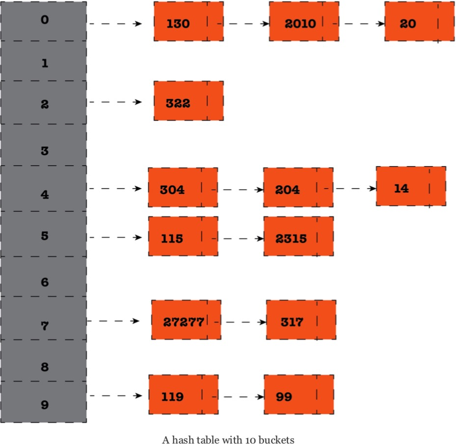

### Go 语言中的哈希表

严格来讲，**哈希表**这种数据结构会存储一至多个键值对，并使用一个哈希函数计算出存放正确值的桶或槽的索引。理想情况下，**哈希函数**应该将每个键分配到唯一的桶中，但通常你事先得有足够数量的桶。

一个好的哈希函数一定要能够输出均匀分布的哈希值，如果有多余的桶或者桶之间的基数差值较大，操作的效率就会变低。此外，这个哈希函数应该具有一致性，对于同一个键始终输出相同的哈希值，否则就不能准确定位需要的数据。

下图展示了一个拥有 10 个桶的哈希表。

